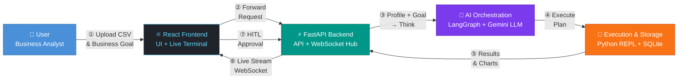

# Autonomous B2B Data Analyst Workspace — Architecture

## Executive Summary (Presentation Slide)

### Data Flow Legend

| Step | Flow | Description |
|------|------|-------------|
| ① | User → Frontend | Upload CSV file + state business goal in natural language |
| ② | Frontend → Backend | HTTP request forwards file and goal to FastAPI |
| ③ | Backend → AI Orchestration | Data profile (schema + stats, not raw CSV) + user goal sent to LangGraph |
| ④ | AI Orchestration → Execution | Gemini generates a cleaning + analysis plan; agents execute it via Python REPL |
| ⑤ | Execution → Backend | Results, statistics, and charts returned to FastAPI |
| ⑥ | Backend → Frontend | Live execution logs and charts streamed back over WebSocket |
| ⑦ | Frontend → Backend | User reviews draft results and submits HITL approval (or revision request) |
