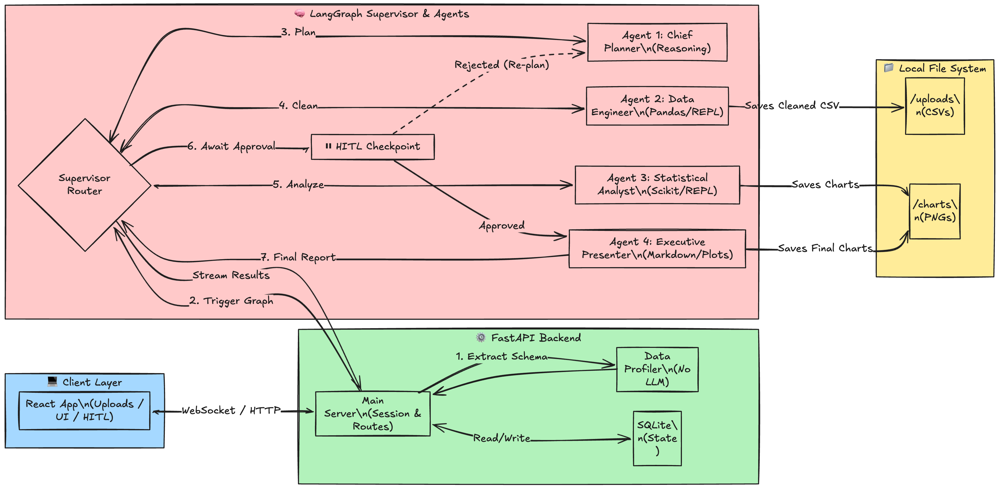

# Autonomous Data Analyst Web (ADAW)

> An end-to-end, multi-agent AI system that transforms raw business data into
> executive-ready insights — autonomously cleaning, analyzing, and presenting data
> through a real-time web interface with a Human-in-the-Loop approval step.


## Overview

ADAW accepts one or more CSV/Excel files and a natural-language business question.
A pipeline of four specialized AI agents, powered by Google Gemini 2.5 Flash via Vertex AI autonomously executes the full data-science workflow:

1. **Plan** the cleaning and analysis steps.
2. **Clean** the raw data with generated Pandas code, executed live in a local REPL.
3. **Analyze** the cleaned data, producing statistical insights and draft charts.
4. **Pause** for human review — the analyst inspects the findings and either approves
   or sends revision feedback before the final report is written.
5. **Present** polished, board-ready charts and a structured Markdown executive summary.

Every code execution, REPL output, and agent transition streams in real time to the
browser via WebSockets, giving a live window into the AI's reasoning process.

---

## Features

| Feature | Description |
|---|---|
| **Multi-Agent LangGraph Pipeline** | Four specialized agents (Chief Planner, Data Engineer, Statistical Analyst, Executive Presenter) orchestrated as a LangGraph `StateGraph` with typed shared state. |
| **Real-Time Live Terminal** | Every line of generated Python code and its REPL stdout streams to the browser immediately. Code blocks are syntax-highlighted; STDOUT blocks are rendered in a green console style. |
| **Human-in-the-Loop (HITL) Checkpoint** | The pipeline pauses after analysis, presents draft charts and insights, and waits for human approval or revision feedback before proceeding to final presentation. |
| **Conditional Revision Routing** | Clicking "Revise" routes the pipeline *back* to the Chief Planner with the user's feedback. The agent incorporates the feedback and re-runs the full analysis. Multiple revision cycles are supported. |
| **Persistent Session History** | Every completed run is persisted to SQLite. Past sessions can be replayed in full charts, executive summary, and the complete agent log without re-running the pipeline. |
| **AST-Safe Code Execution** | All generated code runs inside `PythonAstREPLTool`, a sandboxed Python interpreter that prevents arbitrary code execution beyond the AST-validated subset. |

---

## System Architecture

### Architecture Diagram



---

### Technical Deep-Dive

#### 1. LangGraph Multi-Agent State Machine

The pipeline is implemented as a LangGraph `StateGraph` with a shared `AgentState`
TypedDict. Each of the four nodes receives the full state and returns a partial update;
LangGraph merges the updates into the shared state between steps.

```
START
  └─► chief_planner        (structured output → ExecutionPlan)
        └─► data_engineer   (ReAct loop — executes cleaning code via REPL)
              └─► statistical_analyst  (ReAct loop — analysis + draft charts)
                    └─► hitl_router    ← interrupt_before fires here
                          ├─► chief_planner   (if hitl_feedback is set — revision)
                          └─► executive_presenter  (if hitl_feedback is None — approve)
                                └─► END
```

Each ReAct agent follows the same hardened loop pattern:
- `_coerce_nonempty_content()` strips empty `parts` before every LLM call (required
  by Vertex AI's API).
- `_MAX_REPROMPTS = 5` prevents silent hangs when the model returns a plain-text
  preamble instead of a tool call under quota pressure.

#### 2. The HITL Sentinel Node Pattern

A naive implementation would use `interrupt_before=["executive_presenter"]` with a
static edge from `statistical_analyst → executive_presenter`. This fails because
LangGraph evaluates edges **eagerly**: by the time the interrupt fires, the next
node (`executive_presenter`) is already locked into the checkpoint. Injecting
`hitl_feedback` via `graph.update_state()` updates the state but cannot change the
pre-committed routing target.

The fix is the **Sentinel Node** pattern:

1. A lightweight `hitl_router_node` (returns `{}`) is inserted between the analyst
   and the presenter.
2. `interrupt_before=["hitl_router"]` fires *before* the sentinel runs — no routing
   decision has been made yet.
3. When the user responds and `graph.update_state()` injects the feedback, the graph
   resumes, the sentinel executes, and the **conditional edge** function
   `_route_after_hitl(state)` is called against the *current* state:
   - `hitl_feedback` is set → route to `chief_planner` (revision cycle).
   - `hitl_feedback` is `None` → route to `executive_presenter` (approval).

This defers the routing decision to *after* the human's input lands in state.

#### 3. Phase 1 / Phase 2 WebSocket Architecture

The FastAPI WebSocket handler manages the full pipeline lifecycle in two phases:

**Phase 1** (`graph.astream_events(initial_state, version="v2")`):
Streams `chief_planner → data_engineer → statistical_analyst`. The `astream_events`
generator exhausts when the graph hits `interrupt_before=["hitl_router"]`. The handler
then reads `graph.get_state()` to verify the pause location, extracts the draft chart
paths and analysis insights, and emits a `hitl_pause` message to the frontend.

**HITL handoff** (`websocket.receive_text()`):
The handler awaits a single JSON message: `{"action": "approve"}` or
`{"action": "revise", "feedback": "..."}`. It calls `graph.update_state()` to inject
the decision, then enters Phase 2.

**Phase 2** (`while True: graph.astream_events(None, ...)`):
Resumes the graph. After each `astream_events` call, the handler checks
`graph.get_state().next`:
- If `"hitl_router"` is present, the revision cycle completed and the graph paused
  again. The handler emits a fresh `hitl_pause` with the updated charts and insights
  and awaits another user decision — the loop repeats.
- If `"hitl_router"` is absent, `executive_presenter` ran to completion. The handler
  breaks the loop, reads the final `PresentationResult`, and emits `pipeline_complete`.

After emitting `pipeline_complete`, the handler calls `websocket.close(1000)` for a
graceful teardown, then batch-persists all accumulated logs and node records to SQLite.

---

## Project Structure

```
Data-Analyst-Agent/
├── backend/
│   ├── agents/
│   │   ├── chief_planner.py        # Agent 1 — ExecutionPlan via structured output
│   │   ├── data_engineer.py        # Agent 2 — REPL-based CSV cleaner
│   │   ├── statistical_analyst.py  # Agent 3 — analysis + draft charts
│   │   ├── executive_presenter.py  # Agent 4 — polished charts + Markdown
│   │   └── graph.py                # LangGraph StateGraph definition
│   ├── api/
│   │   ├── main.py                 # FastAPI app, lifespan, static mounts
│   │   ├── sockets.py              # WebSocket handler (Phase 1/2 + HITL loop)
│   │   └── sessions.py             # In-memory session store
│   ├── db/
│   │   └── database.py             # aiosqlite CRUD (sessions, logs, nodes)
│   ├── schemas/
│   │   └── output_schemas.py       # Pydantic output models + AgentState TypedDict
│   └── utils/
│       └── data_profiler.py        # Pandas-based file profiler (no LLM)
├── frontend/
│   ├── src/
│   │   ├── components/
│   │   │   ├── upload/             # UploadView — file drop + query setup
│   │   │   ├── pipeline/           # PipelineView — NodeStatusBar + LiveTerminal
│   │   │   ├── hitl/               # HitlModal — chart review + approval UI
│   │   │   ├── result/             # ResultView — dashboard + agent logs tabs
│   │   │   ├── history/            # HistoryView — past session browser
│   │   │   └── shared/             # ChartGallery
│   │   ├── context/
│   │   │   └── PipelineContext.jsx # useReducer state machine (10 action types)
│   │   ├── hooks/
│   │   │   ├── usePipeline.js      # WebSocket lifecycle + HITL helpers
│   │   │   └── useHistory.js       # REST fetch for session history
│   │   └── lib/
│   │       └── constants.js        # Node display names, WS event map
│   └── vite.config.js              # Dev proxy → FastAPI on :8000
├── requirements.txt                # Python dependencies
└── README.md
```

---

## Local Setup & Installation

### Prerequisites

- Python 3.11+
- Node.js 18+
- A Google Cloud project with the **Vertex AI API** enabled
- `gcloud` CLI authenticated (`gcloud auth application-default login`)

### 1. Clone the repository

```bash
git clone <your-repo-url>
cd Data-Analyst-Agent
```

### 2. Configure Google Cloud credentials

ADAW uses Google Vertex AI (Gemini 2.5 Flash). Authentication is handled via
Application Default Credentials (ADC).

**Option A — gcloud CLI (recommended for local development):**
```bash
gcloud auth application-default login
gcloud config set project <YOUR_GCP_PROJECT_ID>
```

**Option B — Service account key file:**
Create a `.env` file in the project root:
```env
GOOGLE_APPLICATION_CREDENTIALS=/absolute/path/to/your/service-account-key.json
GCP_PROJECT=your-gcp-project-id
GCP_LOCATION=us-central1
(Refer .env.example)
```

### 3. Set up the Python backend

```bash
# Create and activate a virtual environment
python3 -m venv backend/.venv
source backend/.venv/bin/activate          # macOS / Linux
# backend\.venv\Scripts\activate           # Windows

# Install all Python dependencies
pip install -r requirements.txt
```

### 4. Set up the React frontend

```bash
cd frontend
npm install
cd ..
```

### 5. Start the FastAPI backend

From the project root with the venv activated:

```bash
uvicorn backend.api.main:app --reload --host 0.0.0.0 --port 8000
```

The API will be available at `http://localhost:8000`.

### 6. Start the React dev server

In a second terminal:

```bash
cd frontend
npm run dev
```

Open `http://localhost:5173` in your browser. The Vite dev server proxies all
`/upload`, `/ws`, `/sessions`, and `/charts` requests to FastAPI automatically.

---

## Tech Stack

| Layer | Technology |
|---|---|
| Frontend | React 19, Vite 8, Tailwind CSS 4, `react-syntax-highlighter`, `react-markdown` |
| Backend | FastAPI 0.104, uvicorn, WebSockets |
| AI Orchestration | LangGraph 0.6, LangChain 0.3 |
| LLM | Google Vertex AI — `gemini-2.5-flash` |
| Code Execution | `langchain-experimental` `PythonAstREPLTool` |
| Data Science | pandas 2.3, numpy 2.4, scikit-learn 1.5, matplotlib 3.9, seaborn 0.13 |
| Database | SQLite via `aiosqlite` |

---

## License

This project was developed for academic purposes at Stevens Institute of Technology.
